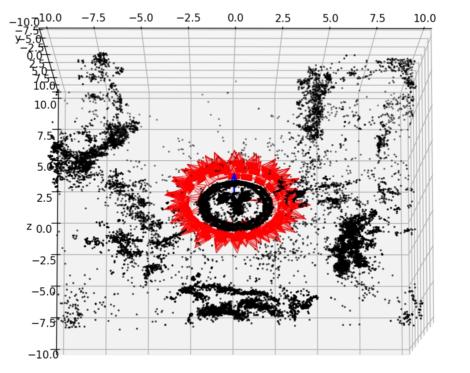

# 3D gaussian splatting data visualization

A simple data visualization script to verify the correctness of training data in 3d gaussian splatting

By default you already have xxx.ply and cameras.json after training [3DGS](https://github.com/graphdeco-inria/gaussian-splatting).

run:

```commandline
python vis_camera_and_point.py --camera_path {xxx/cameras.json} --point_path {xxx/points3D.ply}
```

you will get visualization such as flower scene in mipnerf360.




##  Acknowledgements

Thanks to [extrinsic2pyramid](https://github.com/demul/extrinsic2pyramid) for providing the camera visualization tool.


